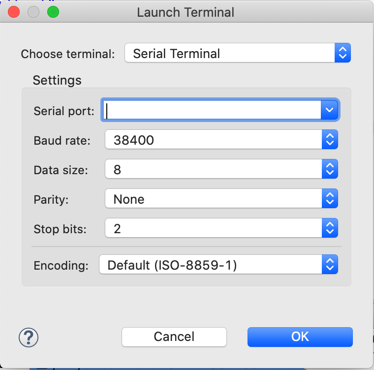
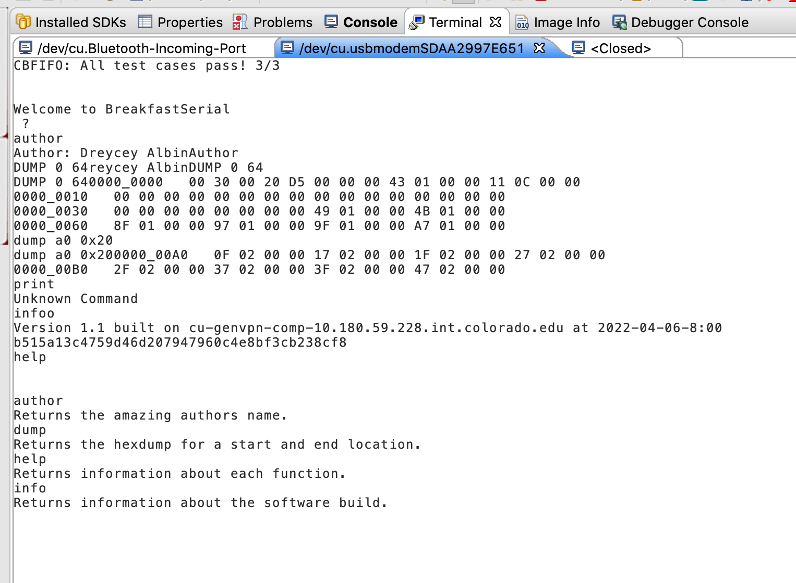

# BreakfastSerial

This repository contains the source code to the PES assignment on UART on the KL25z. 

## Included in the Software

1. The code is written in seporate modules with some including unit testing. 
2. UART is easily reconfigurable using sharp defines, and each module has a corresponding .h file for describing the API 
3. Regarding UART, the commands are echoed back correctly and allow the dump command works smoothly. These commands can be upper or lower case, and there is output if the command is not reccongnized.
4. IT IS VERY VERY EASY TO ADD NEW COMMANDS

## ExtraExtra

1. The backspace key is now accounted for

2. both a 'help' and 'info' method were added to the code base. 

## Screen shots

### setting up UART

### illustrtation of commands

